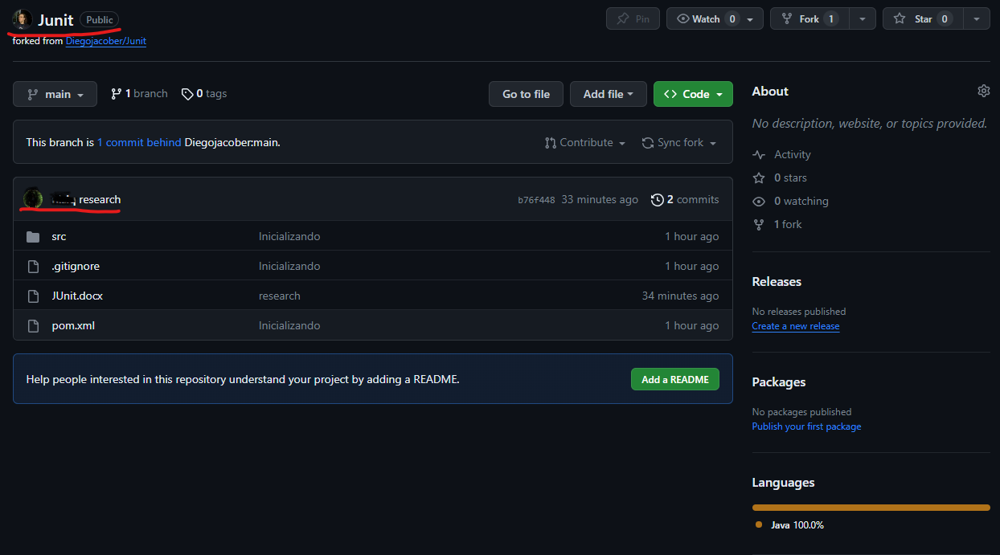
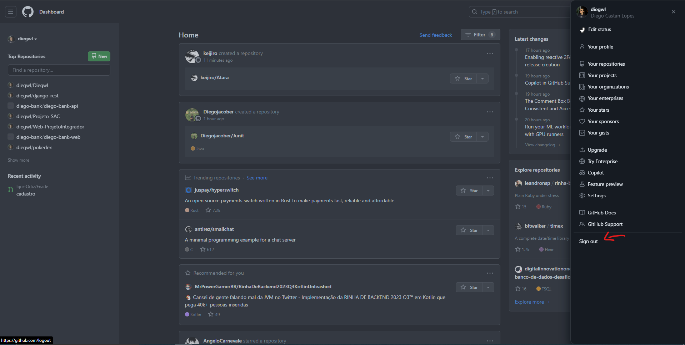
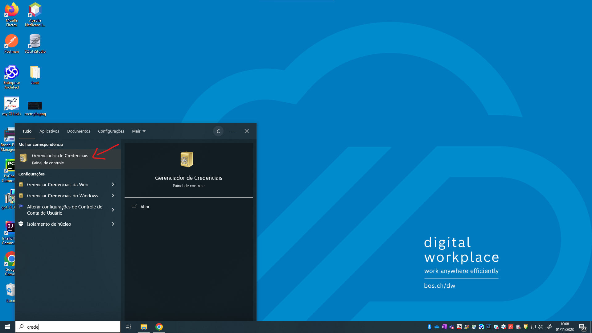
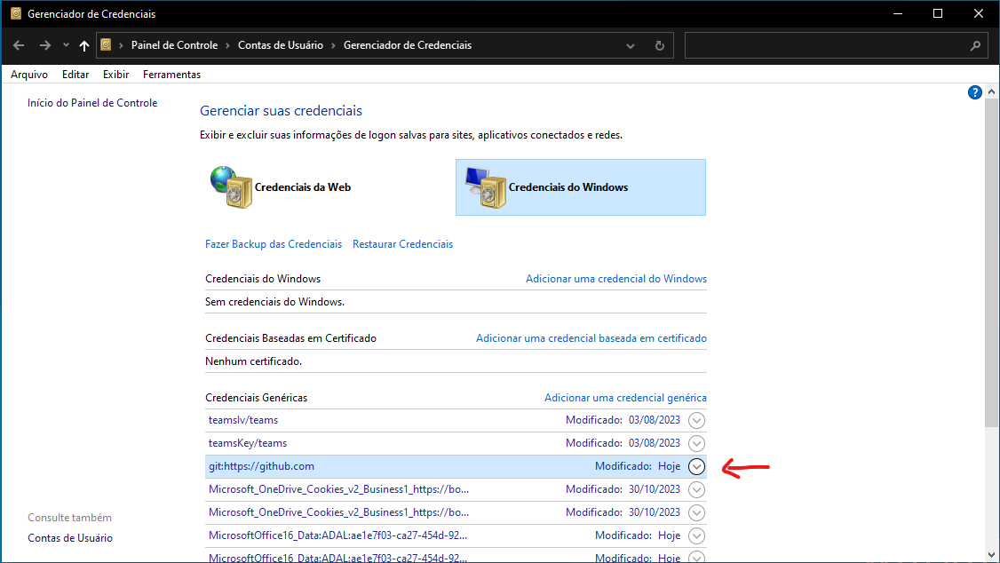
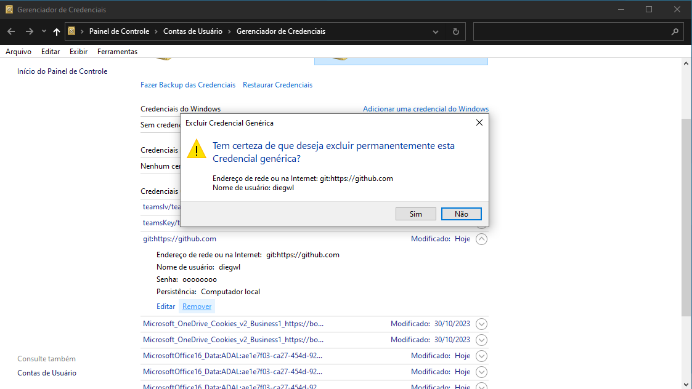
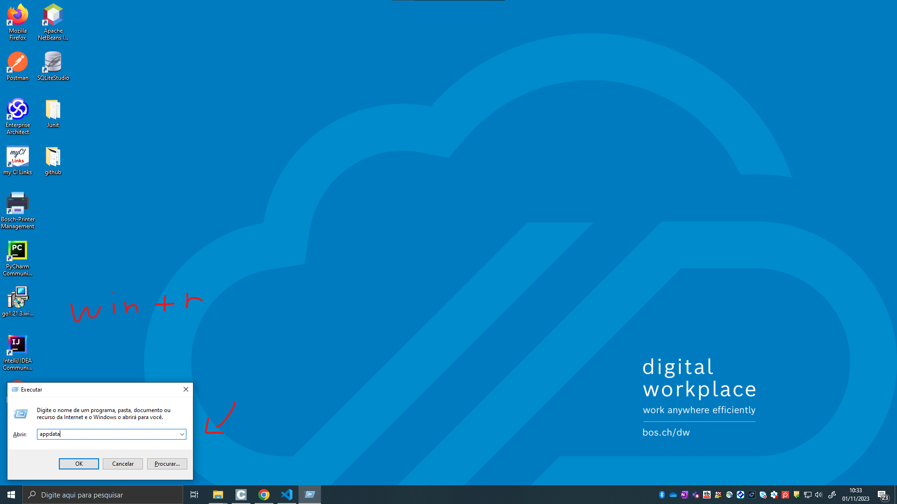
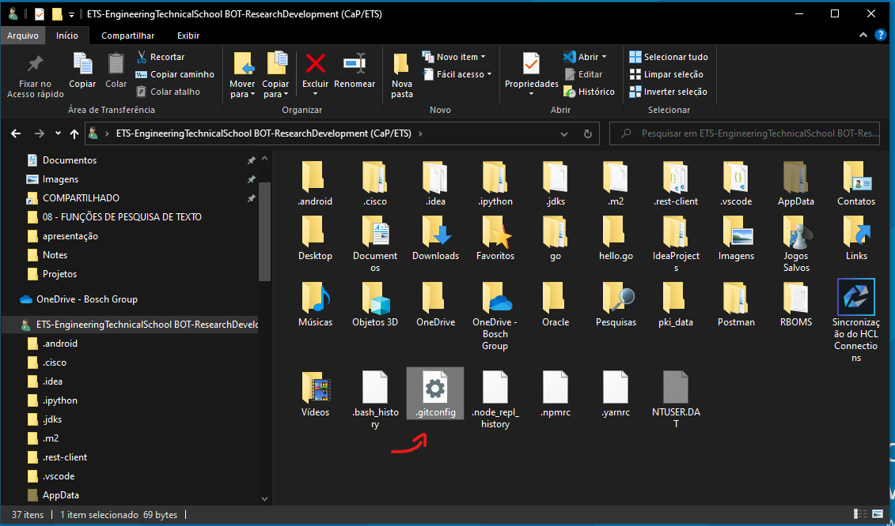
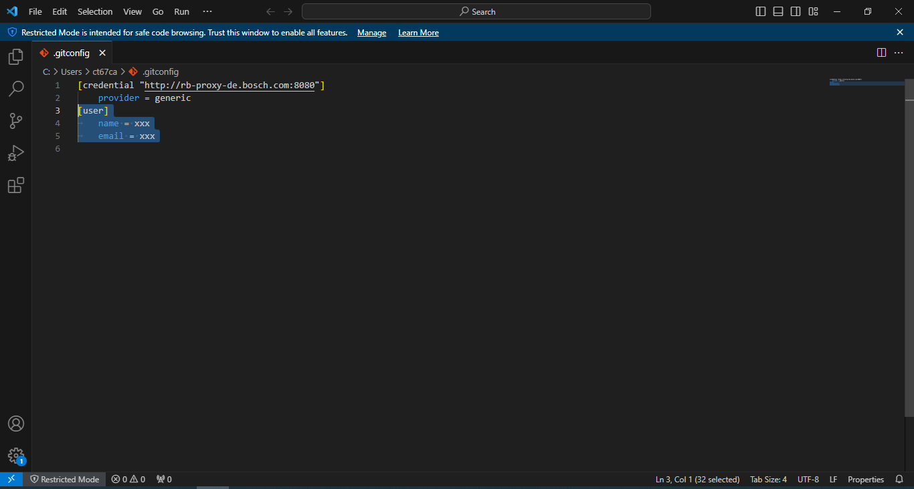

# Porque Deslogar do Github

#### Um guia para aprendizes de Digital Solutions da Bosch Campinas

### Introdução

Dentro da ETS Campinas, a maioria dos aprendizes utiliza um único usuário, dessa forma diversas pessoas o utilizam todos os dias e nos mesmos computadores. Durante o trabalho, precisamos utilizar diversas tecnologias e ferramentas, incluindo o Git e o Github, onde necessitamos de uma conta pessoal, onde temos diversos projetos, trabalhos e estudos pessoais.

### Problemas

Alguém pode mudar sua senha e ter acesso a projetos pessoais e apagá-los, além de que em projetos em que a próxima pessoa estiver trabalhando, algum commit dela pode ficar com o registro da sua conta, que estará registrada no gerenciador de credenciais do computador. Em resumo, os computadores são de uso comunitário, dessa forma não é legal deixar contas logadas, não só a do github, mas em geral, isso pode afetar mais a pessoa que deixou a conta aberta do que qualquer outra.

Este é um exemplo de um commit que foi creditado à conta errada, por conta do gerenciador de credenciais.

### Solução

#### Siga este guia para ter certeza de que você não está deixando nenhum vetígio de seu registro do Git  

- Deslogando Do Github,

- Acessando Credenciais do Windows,

- Acessando Credencial do Github,

- Apagendo sua Credencial,

- Acessando AppData

- Arquivo .gitconfig

- Possível configuração de usuário

- Apagando configuração

- Agora você já está pronto para deixar seu ambiemte de trabalho!!! Obrigado pela atenção.

### Autores

- [diegwl](https://github.com/diegwl)
- [GabrielBonaretti](https://github.com/GabrielBonaretti)
- [AngeloCarnevale](https://github.com/AngeloCarnevale)
- [Diegojacober](https://github.com/Diegojacober)
- [nisiq](https://github.com/nisiq)
